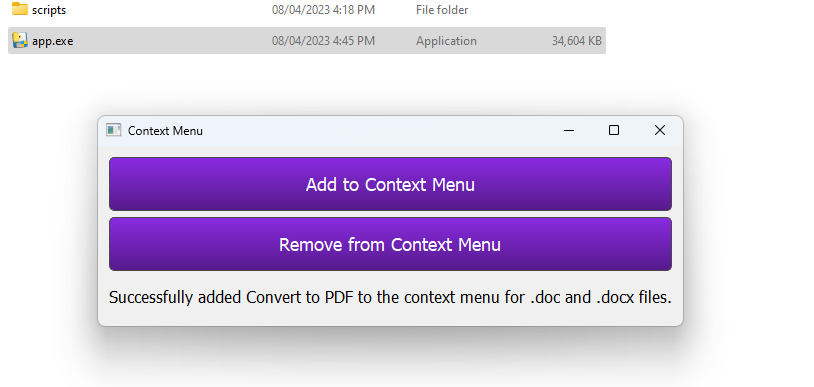
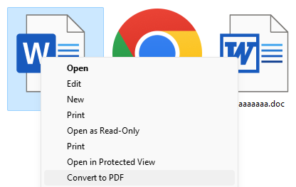

~!DOCS are a work in progress!~

## Description
This is a Python program that adds an option to the Windows context menu to convert Microsoft Word (.doc, .docx) files to PDF format. The program uses the win32com library to interact with Microsoft Word and convert the files to PDF directly from the context menu.

## How to Use
- Download the zip file from the Release page.
- Extract the zip file to a location of your choice.
- Run the app.exe file as an administrator. 
- install the option to the context menu.

That's it! as long as the 'scripts' folder exists, doc/docx files will reference it until you turn the option off.

To convert a Word document to PDF, simply right-click on the file, select "Convert to PDF", and the program will do the rest.

## UI ScreenshotS

## Notes

- If you prefer to run the Python script directly you need to have administrator privileges for the script to work properly.

- pythonw is used

This program has been tested on Windows 11 and Microsoft Word 2021. If you encounter any issues or have any suggestions, please feel free to contact me.

~!DOCS are a work in progress!~
